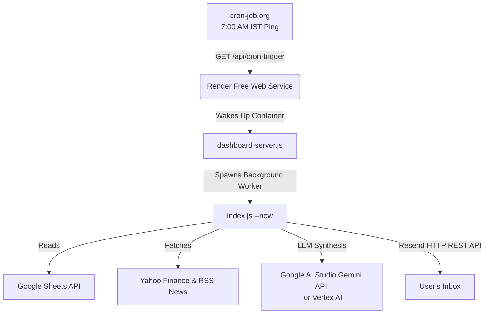

# 📊 Daily Stock Intelligence — Cloud Deployment Guide

An enterprise-grade, lightweight Node.js implementation of the **Daily Stock Intelligence Report** pipeline and interactive **Control Center Dashboard**. 

This system is optimized for a **100% free, card-free cloud deployment** using **Render**, **Google AI Studio (Gemini)**, **Resend**, and **cron-job.org**. You will **not** need to enter any credit card or billing details.

---
https://sreeharshamansani.github.io/stock-intelligence/
## 🌟 How the Zero-Card Cloud Architecture Works



1. **Host Dashboard on Render**: Link your GitHub repository to [Render](https://render.com). The interactive web dashboard and background scheduler run in a single web service.
2. **Auto-Sleep Handling**: Render's free tier sleeps after 15 minutes of inactivity to save resources.
3. **Daily Trigger**: [cron-job.org](https://cron-job.org/) (100% free, no credit card required) pings `https://your-app.onrender.com/api/cron-trigger` at **7:00 AM IST** every weekday.
4. **Instant Run**: This request wakes up your Render container, which instantly executes your entire stock analysis pipeline, compiles the report, and emails it to your inbox!

---

## 🚀 Key Features

* **Flexible Gemini Engine (Dual-Mode):** 
  * *Google AI Studio (Recommended):* Authenticate using a free API key with a generous free tier (no credit card required).
  * *Vertex AI:* Fall back to Google Cloud service account authentication if billing is enabled.
* **Resilient T5 Summarizer:** The system automatically catches timeouts or errors from the Hugging Face T5 space and generates fallback summaries to ensure the main pipeline never crashes.
* **Resend HTTP Mailer:** Bypasses SMTP port blocking on modern cloud hosts like Render by utilizing Resend's secure HTTPS API (port 443).
* **Control Center UI:** Built-in web dashboard to review settings, trigger manual runs, inspect logs, and download past HTML and JSON reports.

---

## 🔒 Step 1: Push Code to a Private GitHub Repository

Because the repository has a secure `.gitignore` file, **your private keys, databases, and configuration settings will never be pushed to the public web**. 

1. Create a free account on [GitHub](https://github.com) (no credit card required).
2. Create a new repository and set it to **Private** (Name: `stock-intelligence`).
3. Run the following commands in your local PC terminal:
   ```bash
   git init
   git add .
   git commit -m "Configure production cloud-trigger pipeline"
   git branch -M main
   git remote add origin https://github.com/YOUR_USERNAME/stock-intelligence.git
   git push -u origin main
   ```

---

## 🔑 Step 2: Acquire API Credentials

To get your app running for free, you will need credentials for Google Sheets, Gemini, and Resend.

### 1. Google Sheets Credentials (Service Account)
1. Go to the [Google Cloud Console](https://console.cloud.google.com).
2. Create a new project named `Stock Intelligence`.
3. Go to **APIs & Services → Library**, search for **Google Sheets API**, and click **Enable**.
4. Go to **IAM & Admin → Service Accounts** and click **Create Service Account**.
5. Give it a name (e.g., `stock-bot-sa`) and click **Done**.
6. Select your newly created service account, go to the **Keys** tab, click **Add Key → Create New Key**, select **JSON**, and download it. Rename it to `google-service-account.json` and place it in your project root.
7. Share your target Google Sheet with your service account's email address as a **Viewer**.

### 2. Gemini API Key (Google AI Studio)
1. Go to [Google AI Studio](https://aistudio.google.com/) and log in with your Google account.
2. Click **Create API Key**.
3. Copy the generated key. This key gives you access to models like `gemini-2.5-flash` on the free tier.

> [!NOTE]
> *Alternatively, you can enable the **Generative Language API** in your GCP Console project and generate an API key under **APIs & Services → Credentials**.*

### 3. Resend API Key (Email Dispatch)
1. Go to [Resend](https://resend.com) and sign up for a free account.
2. Go to the API Keys tab and click **Create API Key** (grant it "Sending" access).
3. Copy the key. The free tier allows you to send up to 3,000 emails per month to your own registered email address using `onboarding@resend.dev`.

---

## ⚙️ Step 3: Configure Environment Variables

Create a file named `.env` in the root of your project (use `.env.example` as a template). 

| Environment Variable | Description | Example Value |
| :--- | :--- | :--- |
| `GEMINI_API_KEY` | Your Google AI Studio API Key | `AIzaSy...` |
| `GEMINI_MODEL` | The Gemini model to target | `gemini-2.5-flash` |
| `RESEND_API_KEY` | Your Resend HTTP API Key | `re_...` |
| `REPORT_TO` | The recipient email address for reports | `user@example.com` |
| `SPREADSHEET_ID` | The ID of your tracking Google Sheet | `1DnVND...` |
| `STOCKS_SHEET_NAME` | The tab name where stocks are configured | `Stocks` |
| `EXPOSURES_SHEET_NAME`| The tab name where theme exposures are listed | `exposure` |
| `T5_BASE_URL` | Hugging Face Space endpoint for T5 | `https://...` |
| `T5_WAIT_SECONDS` | Timeout to wait for Gradio responses | `20` |
| `DB_PATH` | The path to the SQLite cache database | `./data/stock_reports.db` |
| `CRON_SCHEDULE` | Standard cron configuration (Local mode) | `30 1 * * 1-5` |
| `TIMEZONE` | Timezone context for date rendering | `Asia/Kolkata` |

---

## 💻 Step 4: Local Execution & Testing

Install dependencies:
```bash
npm install
```

Run a dry-run test (ignores email dispatch and prints report to console):
```bash
node index.js --now --dry-run
```

Run the interactive dashboard server:
```bash
npm start
```
Open [http://localhost:3000](http://localhost:3000) to access the Control Center Dashboard.

---

## ☁️ Step 5: Deploy to Render (Free Tier)

1. Go to [Render](https://render.com) and sign up using GitHub.
2. Click **New + ➔ Web Service**.
3. Connect your private `stock-intelligence` repository.
4. Configure the Web Service:
   * **Name**: `stock-intelligence`
   * **Region**: Choose the closest region (e.g., Singapore or Oregon).
   * **Runtime**: `Node`
   * **Build Command**: `npm install`
   * **Start Command**: `npm run dashboard` (runs the server in `dashboard-server.js`)
   * **Instance Type**: **Free** ($0/month)
5. Click **Advanced** and add the keys from your `.env` file under **Environment Variables**.
6. **Mount Service Account JSON:**
   * Under **Secret Files** on the Environment tab, click **Add Secret File**.
   * Set **Filename** to `google-service-account.json`.
   * Open your local `google-service-account.json` file, copy all contents, and paste it into the editor.
   * Click **Save Changes**.
7. Click **Create Web Service**.

---

## ⏰ Step 6: Configure the Daily Schedule on `cron-job.org`

Because Render Free Web Services sleep after 15 minutes of inactivity, we use `cron-job.org` to wake up the app and trigger the daily stock pipeline.

1. Go to [cron-job.org](https://cron-job.org/) and create a free account.
2. Click **Create Cronjob**.
3. Configure the Cronjob:
   * **Title**: `Stock Intelligence Daily Run`
   * **Address (URL)**: `https://<YOUR_RENDER_APP_NAME>.onrender.com/api/cron-trigger`
     *(Replace `<YOUR_RENDER_APP_NAME>` with the subdomain assigned to your service by Render, e.g. `https://stock-intelligence-abc.onrender.com/api/cron-trigger`)*
   * **Request Method**: `GET`
   * **Schedule**: Select **User-defined** ➔ **Days of week**: Monday through Friday.
   * **Time**: Select **07:00** (7:00 AM).
   * **Timezone**: Select **Asia/Kolkata** (IST).
4. Click **Create**.

---

## 📂 File Structure

```
stock-intelligence/
├── index.js                     # Pipeline orchestrator (runs via CLI/cron trigger)
├── dashboard-server.js          # Control Center web server & cron-trigger route API
├── google-service-account.json  # Sheets service account credential (ignored by Git)
├── .env                         # Local environment settings (ignored by Git)
├── .gitignore                   # Prevents sensitive files from being pushed to Git
├── package.json                 # Dependency map & startup scripts
├── src/
│   ├── db.js                    # SQLite database storage operations
│   ├── sheets.js                # Google Sheets reader & CSV export fallback
│   ├── macro.js                 # Macro market trackers & general news fetchers
│   ├── exposure.js              # Sector/peer exposure context mapper
│   ├── stock.js                 # Yahoo price parser, sentiment analysis, T5 summaries
│   ├── gemini.js                # Prompt assembler, Gemini API caller & HTML templater
│   └── email.js                 # Resend HTTP REST email API client
├── data/
│   └── stock_reports.db         # Self-maintaining local SQLite database (ephemeral on Free Render)
└── reports/
    └── report_YYYY-MM-DD.html   # HTML archive of generated reports (ephemeral on Free Render)
```

---

## ⚠️ Free Cloud Persistence Warning
On Render's Free Tier, the application container's filesystem is ephemeral. This means that whenever the app goes to sleep or gets redeployed, any new files created on disk (such as `data/stock_reports.db` or cached reports in `reports/`) are reset. 

This **does not affect** your daily stock reports! Every morning, when `cron-job.org` pings your URL, the script will spin up, fetch fresh macro markets and Yahoo Finance prices, analyze the news, query Gemini, and email the beautiful daily report to your inbox successfully. 

*If you ever want to save your historical database runs permanently, you can create a completely free, card-free PostgreSQL database on [Supabase.com](https://supabase.com) and update your `src/db.js` file to connect to it instead of local SQLite!*
