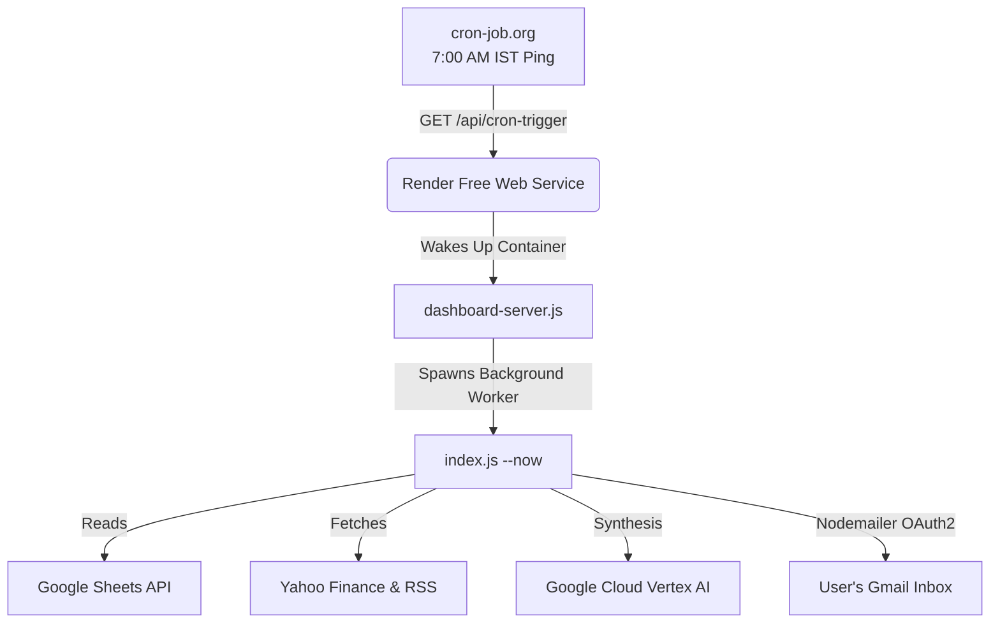

# 📊 Daily Stock Intelligence — Card-Free Cloud Deployment Guide

An enterprise-grade, lightweight Node.js implementation of the **Daily Stock Intelligence Report** pipeline and interactive **Control Center Dashboard**. 

This guide is optimized for a **100% free, card-free cloud deployment** using **Render** and **cron-job.org**. You will **not** need to enter any credit card or billing details.

---

## 🌟 How the Zero-Card Cloud Architecture Works



1. **Host Dashboard on Render**: Link your GitHub repository to [Render](https://render.com). The interactive web dashboard and background scheduler run in a single web service.
2. **Auto-Sleep Handling**: Render's free tier sleeps after 15 minutes of inactivity to save resources.
3. **Daily Trigger**: [cron-job.org](https://cron-job.org/) (100% free, no credit card required) pings `https://your-app.onrender.com/api/cron-trigger` at **7:00 AM IST** every weekday.
4. **Instant Run**: This request wakes up your Render container, which instantly executes your entire stock analysis pipeline, compiles the report, and emails it to your inbox!

---

## 🔒 Step 1: Push Code to a Private GitHub Repository

Because the repository has a secure `.gitignore` file, **your private keys, databases, and configuration settings will never be pushed to the public web**. 

1. Create a free account on [GitHub](https://github.com) (no credit card required).
2. Create a new repository and set it to **Private** (Name: `stock-intelligence`).
3. Run the following commands in your local PC terminal:
   ```bash
   cd C:\Users\Dell\Desktop\stock-intelligence
   git init
   git add .
   git commit -m "Configure production cloud-trigger pipeline"
   git branch -M main
   git remote add origin https://github.com/YOUR_USERNAME/stock-intelligence.git
   git push -u origin main
   ```

---

## 🔑 Step 2: Acquire Unified Google Cloud Credentials

All APIs (Sheets, Gemini Vertex AI, and Gmail Send) run securely under a single Google Cloud Console Project.

### 1. Project & APIs Setup
1. Go to the [Google Cloud Console](https://console.cloud.google.com).
2. Create a new project named `Stock Intelligence`.
3. Go to **APIs & Services → Library**, search for and **Enable** the following APIs:
   - **Google Sheets API**
   - **Vertex AI API**
   - **Gmail API**

### 2. Service Account Key (Sheets & Vertex AI)
1. Go to **IAM & Admin → Service Accounts**.
2. Click **Create Service Account** (Name: `stock-bot-sa`). Click **Create and Continue**.
3. Grant this service account the role **Vertex AI User** (required to run Gemini). Click **Done**.
4. Select your newly created service account, go to the **Keys** tab, click **Add Key → Create New Key**, select **JSON**, and download it.
5. Share your Google Sheet → Click **Share** → Paste the Service Account's email address → Assign **Viewer** permissions.

### 3. OAuth2 Client Setup (Gmail)
To send reports securely through Gmail, set up an OAuth2 Client to obtain a permanent access refresh token.

1. Go to **APIs & Services → OAuth consent screen**:
   - User Type: **External**, configure basic information.
   - Under **Scopes**, click **Add/Remove Scopes**, enter manually: `https://mail.google.com/` (full Gmail access) and add it.
   - Under **Test Users**, click **Add Users** and enter your personal Gmail account (the sender address).
2. Go to **APIs & Services → Credentials**:
   - Click **Create Credentials → OAuth client ID**.
   - Application Type: **Web application**.
   - Name: `Stock Gmail Client`.
   - Under **Authorized redirect URIs**, add: `https://developers.google.com/oauthplayground`.
   - Click **Create** and copy your **Client ID** and **Client Secret**.

### 4. Acquire the Refresh Token
1. Open the [Google OAuth Playground](https://developers.google.com/oauthplayground).
2. Click the **Gear Icon ⚙️** (top right), check **Use own OAuth credentials**, and paste your **Client ID** and **Client Secret**. Click **Close**.
3. Under **Step 1** (Authorize APIs), select **Gmail API v1** on the left (or paste `https://mail.google.com/` in the text box) and click **Authorize APIs**.
4. Authenticate using your sender Gmail account (click *Continue* if warned about an unverified app).
5. Under **Step 2**, click **Exchange authorization code for tokens**.
6. Copy the generated **Refresh Token** from the text input!

---

## 🚀 Step 3: Deploy to Render (No Card Free Tier)

1. Go to [Render](https://render.com) and click **Sign Up** (Choose "GitHub" to log in instantly, no credit card required).
2. Click **New + ➔ Web Service**.
3. Select your private `stock-intelligence` repository and click **Connect**.
4. Configure the Web Service:
   - **Name**: `stock-intelligence`
   - **Region**: Choose a region closest to your audience (e.g., Singapore or Oregon).
   - **Branch**: `main`
   - **Runtime**: `Node`
   - **Build Command**: `npm install`
   - **Start Command**: `npm run dashboard` (Runs `node dashboard-server.js`)
   - **Instance Type**: **Free** ($0/month)

---

## ⚙️ Step 4: Add Variables & Service Key in Render

Since Render ignores local `.env` and credential files for security, you must supply them via Render's secure configuration manager.

### 1. Configure Environment Variables
In your Render dashboard, navigate to the **Environment** tab of your service, click **Add Environment Variable**, and input the following keys (copy their values from your local `.env`):

| Key | Value |
| :--- | :--- |
| `SPREADSHEET_ID` | `YOUR_GOOGLE_SPREADSHEET_ID` |
| `STOCKS_SHEET_NAME` | `Stocks` |
| `EXPOSURES_SHEET_NAME` | `exposure` |
| `GOOGLE_CLIENT_ID` | `YOUR_GOOGLE_CLIENT_ID` |
| `GOOGLE_CLIENT_SECRET` | `YOUR_GOOGLE_CLIENT_SECRET` |
| `GOOGLE_REFRESH_TOKEN` | `YOUR_GOOGLE_REFRESH_TOKEN` |
| `GMAIL_USER` | `your_sender_gmail@gmail.com` |
| `REPORT_TO` | `your_recipient@gmail.com` |
| `DB_PATH` | `./data/stock_reports.db` |
| `T5_BASE_URL` | `https://harsha000007-t5-model.hf.space/gradio_api/call/predict` |
| `T5_WAIT_SECONDS` | `20` |

### 2. Configure the Service Account Key File
Render allows mounting secure system files directly into your application:
1. In the **Environment** tab on Render, scroll down to the **Secret Files** section.
2. Click **Add Secret File**.
3. **Filename**: `google-service-account.json`
4. **Contents**: Open your local `google-service-account.json` key file, copy the entire JSON content, and paste it into the text value field.
5. Click **Save Changes**. Render will automatically mount this file securely in the root of your application upon deployment!

---

## ⏰ Step 5: Configure the Daily Schedule on `cron-job.org`

Because Render Free Web Services sleep after 15 minutes of inactivity, we use `cron-job.org` to wake up the app and trigger the daily stock pipeline.

1. Go to [cron-job.org](https://cron-job.org/) and create a free account (no credit card required).
2. In the dashboard, click **Create Cronjob**.
3. Configure the Cronjob:
   - **Title**: `Stock Intelligence Daily Run`
   - **Address (URL)**: `https://<YOUR_RENDER_APP_NAME>.onrender.com/api/cron-trigger`
     *(Replace `<YOUR_RENDER_APP_NAME>` with the subdomain assigned to your service by Render, e.g. `https://stock-intelligence-abc.onrender.com/api/cron-trigger`)*
   - **Request Method**: `GET`
   - **Schedule**: Select **User-defined** ➔ **Days of week**: Monday through Friday.
   - **Time**: Select **07:00** (7:00 AM).
   - **Timezone**: Select **Asia/Kolkata** (IST).
4. Click **Create**.

---

## 📊 Step 6: Verify and Connect!

1. Open your web browser and navigate to your Render URL: `https://<YOUR_RENDER_APP_NAME>.onrender.com`.
2. You will be greeted by the premium **Stock Intelligence Control Center**.
3. Navigate to **System Configuration** to inspect your settings (including OAuth2 keys and sheets tabs).
4. Click **⚡ Run Pipeline Now** to execute the pipeline in real-time. Watch the live console logs print each phase:
   - Database row cleanup
   - Google Sheet fetching (via SA or CSV url fallback)
   - Yahoo Finance API fetches
   - Sentiment calculations and T5 summary integrations
   - Vertex AI Report syntheses
   - Nodemailer OAuth2 Gmail dispatches
5. Check your email inbox to view the beautifully typeset daily report!

---

## 📂 File Map & Customizations

```
stock-intelligence/
├── index.js                     # Central pipeline orchestrator triggered via CLI/cron
├── dashboard-server.js          # Control Center web server (Port 3000) with /api/cron-trigger route
├── google-service-account.json  # Google service account key (Ignored by Git, mounted by Render)
├── .env                         # Environment configurations (Ignored by Git, configured in Render)
├── .gitignore                   # Guards your private credentials from GitHub exposure
├── package.json                 # Core dependencies and npm start scripts
├── src/
│   ├── db.js                    # SQLite database connections and raw data queries
│   ├── sheets.js                # Google Sheets reader (Service Account + CSV exports fallback)
│   ├── macro.js                 # Yahoo Finance indices + Google News RSS parsing
│   ├── exposure.js              # Theme-exposure mapping and parallel fetch scripts
│   ├── stock.js                 # Yahoo price tickers + Sentiment + T5 Summarizers
│   ├── gemini.js                # Prompt constructions, Vertex AI API, and HTML engines
│   └── email.js                 # Gmail Nodemailer SMTP (Type: OAuth2 auth setup)
├── data/
│   └── stock_reports.db         # Self-maintaining local SQLite database
└── reports/
    └── report_YYYY-MM-DD.html   # Locally cached historical HTML reports
```

---

## ⚠️ Free Cloud Storage Persistence Note
On Render's Free Tier, the application container's filesystem is ephemeral. This means that whenever the app goes to sleep or gets redeployed, any new files created on disk (such as `data/stock_reports.db` or cached reports in `reports/`) are reset. 

This **does not affect** your daily stock reports! Every morning, when `cron-job.org` pings your URL, the script will spin up, fetch fresh macro markets and Yahoo Finance prices, analyze the news, query Vertex AI, and email the beautiful daily report to your inbox successfully. 

*If you ever want to save your historical database runs permanently, you can create a completely free, card-free PostgreSQL database on [Supabase.com](https://supabase.com) and update your `src/db.js` file to connect to it instead of local SQLite!*
